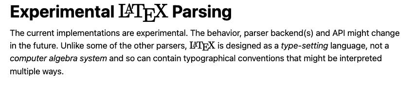
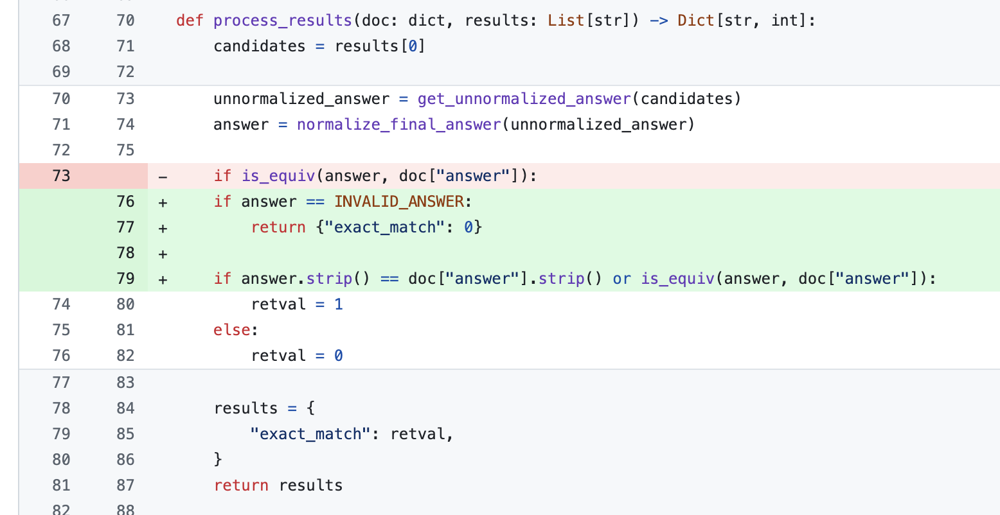

# 使用LaTeX 评估数学能力

解析 latex 很难。这个问题在评估输出为 $\LaTeX$ 的模型时经常会遇到，例如 HuggingFace 的 [数学评估基准](https://huggingface.co/datasets/lighteval/MATH)。

这个基准使用 $\LaTeX$ 来表示数学领域的计算和符号。评估难点在于对模型输出与标准答案的解析和比较。
结果表明，解析 $\LaTeX$ 没有标准方法。


  
*摘自 [`sympy`](https://github.com/sympy/sympy) 文档*

lm-evaluation 框架使用 [`sympy`](https://github.com/sympy/sympy) (一个用于符号数学的 Python 库) 来对 latex 进行解析和比较。 
使用 `sympy` 解析真值 (用真值自身对比测试) 只能得到约 0.94 的准确率。
怎么会是这样呢？后来发现 `sympy` 无法解析某些 (标准的 $\LaTeX$) 表达式。

例如：

```
couldn't parse one of [0,1) 或 [0,1)， I expected one of these: ']'
[0,1)
~~^
```

```
couldn't parse one of (-\iny,-5]\cup[5,\iny) or (-\iny,-5]\cup[5,\iny), I expected something else here
(-\iny,-5]\cup[5,\iny)
~~~~~~^
```

```
couldn't parse one of -\frac{1}{{}2x} or -\frac{1}{{}2x}, I don't understand this
-\frac{1}{{}2x}
~~~~~~~~~~~^
```

### 如何缓解这个问题？

重写 $\LaTeX$ [语法](https://github.com/sympy/sympy/blob/master/sympy/parsing/latex/lark/grammar/latex.lark) 并在代码中添加必须功能；或者往代码里添加人工检查来提高模型得分。
在掉入问题陷阱之后，我们决定在代码中添加字符串比较检查，这方法已经足以缓解。

  
*LM 评估工具修复*

### 结果

修复前后模型 top25 对比结果表格如下：

<div id="xdihwljbql" style="padding-left:0px;padding-right:0px;padding-top:10px;padding-bottom:10px;overflow-x:auto;overflow-y:auto;width:auto;height:auto;">
<table class="gt_table" data-quarto-disable-processing="false" data-quarto-bootstrap="false">
<thead>
  <tr class="gt_heading">
    <td colspan="5" class="gt_heading gt_title gt_font_normal">解析器修复前后模型在 MATH 基准测试结果对比</td>
  </tr>
<tr class="gt_col_headings gt_spanner_row">
  <th class="gt_col_heading gt_columns_bottom_border gt_left" rowspan="2" colspan="1" scope="col" id="Model">Model</th>
  <th class="gt_center gt_columns_top_border gt_column_spanner_outer" rowspan="1" colspan="2" scope="colgroup" id="Score">
    <span class="gt_column_spanner">Score</span>
  </th>
  <th class="gt_center gt_columns_top_border gt_column_spanner_outer" rowspan="1" colspan="2" scope="colgroup" id="Rank">
    <span class="gt_column_spanner">Rank</span>
  </th>
</tr>
<tr class="gt_col_headings">
  <th class="gt_col_heading gt_columns_bottom_border gt_right" rowspan="1" colspan="1" scope="col" id="Original">Original</th>
  <th class="gt_col_heading gt_columns_bottom_border gt_right" rowspan="1" colspan="1" scope="col" id="Fixed parser">Fixed parser</th>
  <th class="gt_col_heading gt_columns_bottom_border gt_right" rowspan="1" colspan="1" scope="col" id="Original">Original</th>
  <th class="gt_col_heading gt_columns_bottom_border gt_right" rowspan="1" colspan="1" scope="col" id="Fixed parser">Fixed parser</th>
</tr>
</thead>
<tbody class="gt_table_body">
  <tr>
    <td class="gt_row gt_left">rombodawg/Rombos-LLM-V2.5-Qwen-72b</td>
    <td class="gt_row gt_right">47.58</td>
    <td class="gt_row gt_right">50.68</td>
    <td style="color: #FFFFFF; background-color: #000000;" class="gt_row gt_right">1</td>
    <td style="color: #FFFFFF; background-color: #000000;" class="gt_row gt_right">1</td>
  </tr>
  <tr>
    <td class="gt_row gt_left">MaziyarPanahi/calme-2.2-qwen2-72b</td>
    <td class="gt_row gt_right">41.16</td>
    <td class="gt_row gt_right">43.43</td>
    <td style="color: #FFFFFF; background-color: #41181f;" class="gt_row gt_right">2</td>
    <td style="color: #FFFFFF; background-color: #41181f;" class="gt_row gt_right">2</td>
  </tr>
  <tr>
    <td class="gt_row gt_left">arcee-ai/Arcee-Nova</td>
    <td class="gt_row gt_right">40.48</td>
    <td class="gt_row gt_right">42.90</td>
    <td style="color: #FFFFFF; background-color: #82303e;" class="gt_row gt_right">3</td>
    <td style="color: #FFFFFF; background-color: #82303e;" class="gt_row gt_right">3</td>
  </tr>
  <tr>
    <td class="gt_row gt_left">fblgit/TheBeagle-v2beta-32B-MGS</td>
    <td class="gt_row gt_right">39.43</td>
    <td class="gt_row gt_right">42.52</td>
    <td style="color: #FFFFFF; background-color: #c3495e;" class="gt_row gt_right">4</td>
    <td style="color: #FFFFFF; background-color: #c3495e;" class="gt_row gt_right">4</td>
  </tr>
  <tr>
    <td class="gt_row gt_left">rombodawg/Rombos-LLM-V2.5-Qwen-32b</td>
    <td class="gt_row gt_right">39.12</td>
    <td class="gt_row gt_right">41.99</td>
    <td style="color: #000000; background-color: #ca6866;" class="gt_row gt_right">5</td>
    <td style="color: #000000; background-color: #ca6866;" class="gt_row gt_right">5</td>
  </tr>
  <tr>
    <td class="gt_row gt_left">dnhkng/RYS-XLarge</td>
    <td class="gt_row gt_right">38.97</td>
    <td class="gt_row gt_right">41.24</td>
    <td style="color: #000000; background-color: #a58c5e;" class="gt_row gt_right">6</td>
    <td style="color: #000000; background-color: #a58c5e;" class="gt_row gt_right">6</td>
  </tr>
  <tr>
    <td class="gt_row gt_left">dfurman/CalmeRys-78B-Orpo-v0.1</td>
    <td class="gt_row gt_right">37.92</td>
    <td class="gt_row gt_right">40.71</td>
    <td style="color: #000000; background-color: #6ec352;" class="gt_row gt_right">8</td>
    <td style="color: #000000; background-color: #80b156;" class="gt_row gt_right">7</td>
  </tr>
  <tr>
    <td class="gt_row gt_left">MaziyarPanahi/calme-2.2-rys-78b</td>
    <td class="gt_row gt_right">37.92</td>
    <td class="gt_row gt_right">39.95</td>
    <td style="color: #000000; background-color: #6ec352;" class="gt_row gt_right">8</td>
    <td style="color: #000000; background-color: #4cbd81;" class="gt_row gt_right">9</td>
  </tr>
  <tr>
    <td class="gt_row gt_left">MaziyarPanahi/calme-2.4-rys-78b</td>
    <td class="gt_row gt_right">37.69</td>
    <td class="gt_row gt_right">40.41</td>
    <td style="color: #000000; background-color: #4cbd81;" class="gt_row gt_right">9</td>
    <td style="color: #000000; background-color: #5ece55;" class="gt_row gt_right">8</td>
  </tr>
  <tr>
    <td class="gt_row gt_left">MaziyarPanahi/calme-2.3-rys-78b</td>
    <td class="gt_row gt_right">36.56</td>
    <td class="gt_row gt_right">38.97</td>
    <td style="color: #000000; background-color: #3aacad;" class="gt_row gt_right">10</td>
    <td style="color: #000000; background-color: #3aacad;" class="gt_row gt_right">10</td>
  </tr>
  <tr>
    <td class="gt_row gt_left">MaziyarPanahi/calme-2.1-rys-78b</td>
    <td class="gt_row gt_right">36.40</td>
    <td class="gt_row gt_right">38.90</td>
    <td style="color: #000000; background-color: #279cd9;" class="gt_row gt_right">11</td>
    <td style="color: #000000; background-color: #279cd9;" class="gt_row gt_right">11</td>
  </tr>
  <tr>
    <td class="gt_row gt_left">Qwen/Qwen2.5-72B</td>
    <td class="gt_row gt_right">36.10</td>
    <td class="gt_row gt_right">38.67</td>
    <td style="color: #000000; background-color: #23a7e6;" class="gt_row gt_right">12</td>
    <td style="color: #000000; background-color: #23a7e6;" class="gt_row gt_right">12</td>
  </tr>
  <tr>
    <td class="gt_row gt_left">MaziyarPanahi/calme-2.1-qwen2-72b</td>
    <td class="gt_row gt_right">36.03</td>
    <td class="gt_row gt_right">38.07</td>
    <td style="color: #000000; background-color: #25bce6;" class="gt_row gt_right">13</td>
    <td style="color: #000000; background-color: #36d0e2;" class="gt_row gt_right">15</td>
  </tr>
  <tr>
    <td class="gt_row gt_left">Qwen/Qwen2-Math-72B-Instruct</td>
    <td class="gt_row gt_right">35.95</td>
    <td class="gt_row gt_right">38.14</td>
    <td style="color: #000000; background-color: #27d2e5;" class="gt_row gt_right">14</td>
    <td style="color: #000000; background-color: #27d2e5;" class="gt_row gt_right">14</td>
  </tr>
  <tr>
    <td class="gt_row gt_left">dfurman/Qwen2-72B-Orpo-v0.1</td>
    <td class="gt_row gt_right">35.42</td>
    <td class="gt_row gt_right">38.14</td>
    <td style="color: #000000; background-color: #36d0e2;" class="gt_row gt_right">15</td>
    <td style="color: #000000; background-color: #25bce6;" class="gt_row gt_right">13</td>
  </tr>
  <tr>
    <td class="gt_row gt_left">abacusai/Smaug-Qwen2-72B-Instruct</td>
    <td class="gt_row gt_right">35.35</td>
    <td class="gt_row gt_right">37.46</td>
    <td style="color: #000000; background-color: #6691d6;" class="gt_row gt_right">16</td>
    <td style="color: #000000; background-color: #d73a91;" class="gt_row gt_right">19</td>
  </tr>
  <tr>
    <td class="gt_row gt_left">anthracite-org/magnum-v1-72b</td>
    <td class="gt_row gt_right">35.27</td>
    <td class="gt_row gt_right">37.69</td>
    <td style="color: #FFFFFF; background-color: #ae33c4;" class="gt_row gt_right">18</td>
    <td style="color: #000000; background-color: #7e72d0;" class="gt_row gt_right">16</td>
  </tr>
  <tr>
    <td class="gt_row gt_left">alpindale/magnum-72b-v1</td>
    <td class="gt_row gt_right">35.27</td>
    <td class="gt_row gt_right">37.69</td>
    <td style="color: #FFFFFF; background-color: #ae33c4;" class="gt_row gt_right">18</td>
    <td style="color: #000000; background-color: #7e72d0;" class="gt_row gt_right">16</td>
  </tr>
  <tr>
    <td class="gt_row gt_left">Qwen/Qwen2-72B-Instruct</td>
    <td class="gt_row gt_right">35.12</td>
    <td class="gt_row gt_right">37.69</td>
    <td style="color: #000000; background-color: #d73a91;" class="gt_row gt_right">19</td>
    <td style="color: #FFFFFF; background-color: #c614be;" class="gt_row gt_right">18</td>
  </tr>
  <tr>
    <td class="gt_row gt_left">dnhkng/RYS-XLarge-base</td>
    <td class="gt_row gt_right">34.67</td>
    <td class="gt_row gt_right">37.16</td>
    <td style="color: #000000; background-color: #e3715f;" class="gt_row gt_right">20</td>
    <td style="color: #000000; background-color: #e3715f;" class="gt_row gt_right">20</td>
  </tr>
  <tr>
    <td class="gt_row gt_left">Undi95/MG-FinalMix-72B</td>
    <td class="gt_row gt_right">33.61</td>
    <td class="gt_row gt_right">36.10</td>
    <td style="color: #000000; background-color: #f4c314;" class="gt_row gt_right">22</td>
    <td style="color: #000000; background-color: #eea82d;" class="gt_row gt_right">21</td>
  </tr>
  <tr>
    <td class="gt_row gt_left">abacusai/Dracarys-72B-Instruct</td>
    <td class="gt_row gt_right">33.61</td>
    <td class="gt_row gt_right">35.65</td>
    <td style="color: #000000; background-color: #f4c314;" class="gt_row gt_right">22</td>
    <td style="color: #000000; background-color: #eac222;" class="gt_row gt_right">22</td>
  </tr>
  <tr>
    <td class="gt_row gt_left">Qwen/Qwen2.5-32B</td>
    <td class="gt_row gt_right">32.85</td>
    <td class="gt_row gt_right">35.50</td>
    <td style="color: #000000; background-color: #d1b64b;" class="gt_row gt_right">23</td>
    <td style="color: #000000; background-color: #d1b64b;" class="gt_row gt_right">23</td>
  </tr>
  <tr>
    <td class="gt_row gt_left">anthracite-org/magnum-v2-72b</td>
    <td class="gt_row gt_right">31.65</td>
    <td class="gt_row gt_right">34.06</td>
    <td style="color: #000000; background-color: #b7aa75;" class="gt_row gt_right">24</td>
    <td style="color: #000000; background-color: #b7aa75;" class="gt_row gt_right">24</td>
  </tr>
  <tr>
    <td class="gt_row gt_left">dnhkng/RYS-Huge-bnb-4bit</td>
    <td class="gt_row gt_right">31.57</td>
    <td class="gt_row gt_right">33.84</td>
    <td style="color: #000000; background-color: #9e9e9e;" class="gt_row gt_right">25</td>
    <td style="color: #000000; background-color: #9e9e9e;" class="gt_row gt_right">25</td>
  </tr>
</tbody>
</table>
</div>

